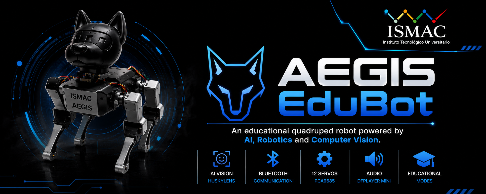

<p align="center">
  
</p>

<h1 align="center">🐺 AEGIS EduBot</h1>

<p align="center">
  <strong>An educational quadruped robot powered by ESP32, Computer Vision and Artificial Intelligence.</strong>
</p>

<p align="center">
  
  
  
  
</p>

---

# 📖 Overview

**AEGIS (Automated Educational Guide with Intelligent System)** is an educational quadruped robot designed to bring Artificial Intelligence, Robotics, and Computer Vision closer to students through interactive learning experiences.

Powered by an **ESP32**, **HuskyLens AI Vision Sensor**, **PCA9685**, and **DFPlayer Mini**, AEGIS combines intelligent locomotion, computer vision, Bluetooth communication, and educational activities to promote STEM learning and environmental awareness.

---

# ✨ Features

- 🤖 Quadruped Robot
- 👁️ AI Vision with HuskyLens
- 📱 Bluetooth Communication
- 🎵 Audio Feedback (DFPlayer Mini)
- ⚙️ 12 Servo Motors
- 🔋 Battery Powered
- 🖨️ Fully 3D Printed
- 🌱 Environmental Education

---

# 🎯 Educational Modes

### 👤 Face Recognition
Recognizes previously trained faces and interacts with users.

### 🎨 English Color Learning
Detects colors while teaching their pronunciation in English.

### ♻️ Waste Classification
Recognizes recyclable materials to promote environmental awareness.

---

# 🛠 Hardware

| Component | Model |
|-----------|----------------------|
| Microcontroller | ESP32 DevKitC V4 |
| Vision Sensor | HuskyLens 2 |
| Servo Driver | PCA9685 |
| Audio Module | DFPlayer Mini |
| Servomotors | 12x Servo Motors |
| Battery | Li-Ion 18650 |
| Structure | PLA+ / PETG |

---

# 📂 Repository Structure

```text
AEGIS/
│
├── .github/
│   └── workflows/
│
├── BOM/
├── CAD/
├── Docs/
├── Electronics/
├── Firmware/
├── Media/
├── Results/
│
├── .gitignore
├── LICENSE
└── README.md
```

---

# 🚀 Getting Started

Clone the repository

```bash
git clone https://github.com/chicaizadiego55-tech/AEGIS-V1.0.git
```

Open the project

```text
Firmware/AEGIS.ino
```

Compile and upload using **Arduino IDE** with the **ESP32 Boards Package** installed.

---
# 📄 Documentation

| Folder | Description |
|---------|-------------|
| **BOM** | Bill of Materials |
| **CAD** | 3D Models (SolidWorks & STL) |
| **Docs** | User and Technical Manuals |
| **Electronics** | Schematics & Wiring |
| **Firmware** | ESP32 Source Code |
| **Media** | Images and Project Banner |
| **Results** | Validation and Experimental Results |

---


# 👨‍💻 Developed By


**ISMAC – Instituto Tecnológico Universitario**

2026 © AEGIS 
